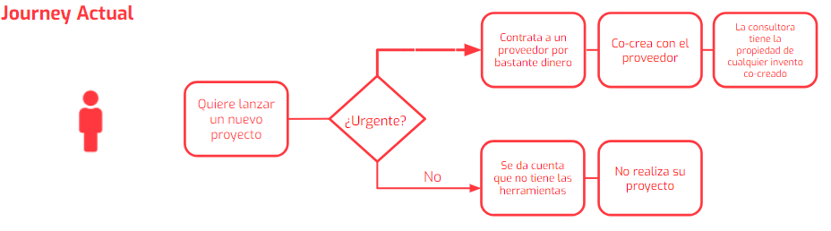
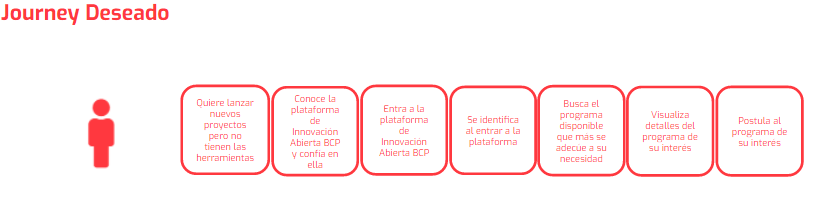

# CIX - BCP
Es una plataforma digital interna desarrollada para el Banco de Crédito del Perú [BCP](https://www.viabcp.com/wps/portal/Home/nosotros). Permite mostrar los diferentes proyectos que maneja el Centro de Innovación del banco a todas la áreas internas que requieran mejoras en sus procesos.

## Desarrollado para [Laboratoria](http://www.laboratoria.la/)

## El Reto

El Banco de Crédito del Perú, en adelante BCP. Es el banco más grande y el proveedor líder de servicios financieros integrados en el Perú, sin embargo no basta con ser un banco líder en el rubro, se necesita innovar y romper paradigmas, promover una cultura colaborativa centrada en las personas y dar paso a la Transformación Digital.

> ¿Cómo acercar proyectos de innovación liderados por el Centro de Innovación a las más de 150 áreas del banco?

### Requerimientos

La solución digital debe:

+ Ser eficiente y minimizar esfuerzo humano
+ Dejar clara la propuesta de valor para los gerentes
+ Empoderar a los gerentes a emprender nuevos proyectos con el ecosistema
+ Hacer que los gerentes "crean" el valor que trae la innovación abierta

---

## Proceso de Desarrollo

### Research

El Journey otorgado por la misma entidad bancaria eran los siguientes:

  

 