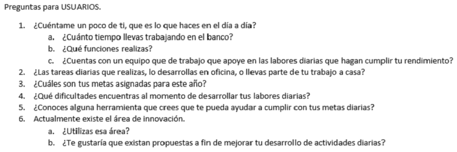
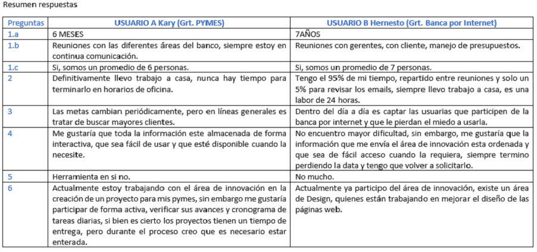
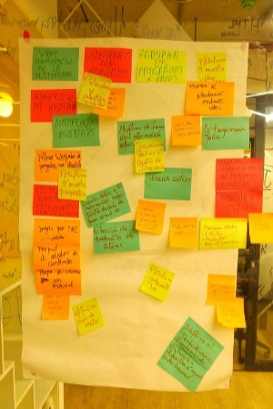
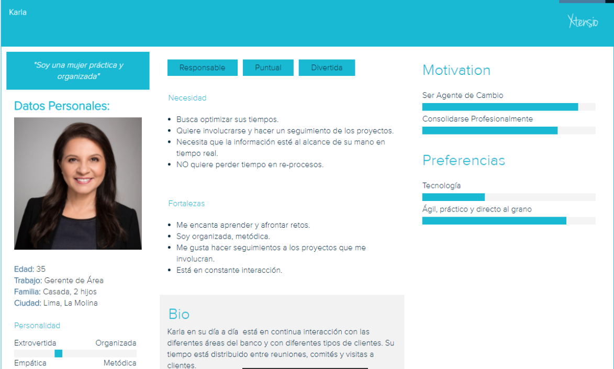
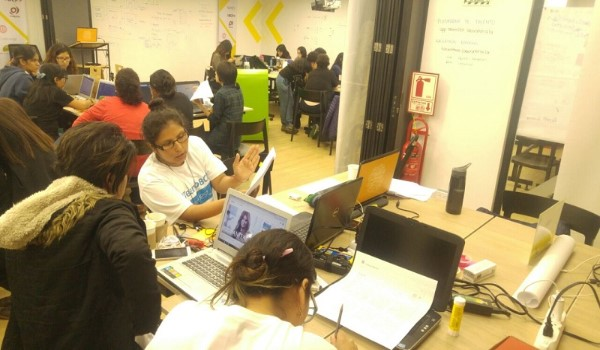
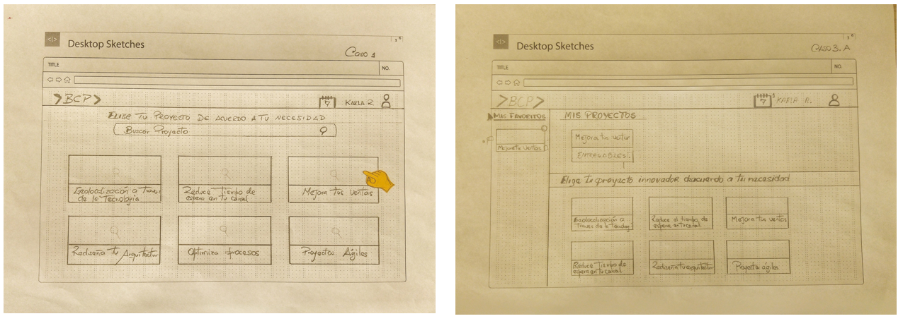
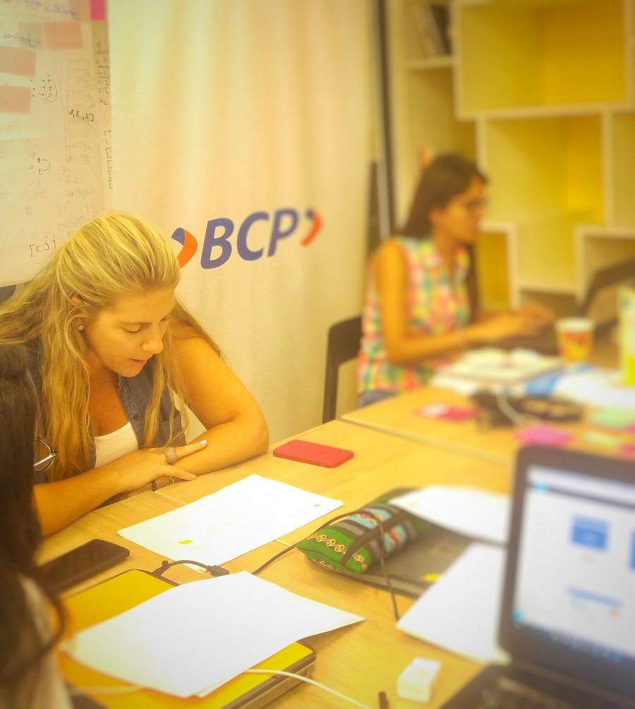
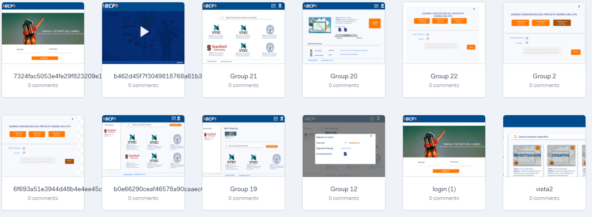

# CIX - BCP
Es una plataforma digital interna desarrollada para el Banco de Crédito del Perú [BCP](https://www.viabcp.com/wps/portal/Home/nosotros). Permite mostrar los diferentes proyectos que maneja el Centro de Innovación del banco a todas la áreas internas que requieran mejoras en sus procesos.

## Desarrollado para [Laboratoria](http://www.laboratoria.la/)

## El Reto

El Banco de Crédito del Perú, en adelante BCP. Es el banco más grande y el proveedor líder de servicios financieros integrados en el Perú, sin embargo no basta con ser un banco líder en el rubro, se necesita innovar y romper paradigmas, promover una cultura colaborativa centrada en las personas y dar paso a la Transformación Digital.

> ¿Cómo acercar proyectos de innovación liderados por el Centro de Innovación a las más de 150 áreas del banco?

### Requerimientos

La solución digital debe:

+ Ser eficiente y minimizar esfuerzo humano
+ Dejar clara la propuesta de valor para los gerentes
+ Empoderar a los gerentes a emprender nuevos proyectos con el ecosistema
+ Hacer que los gerentes "crean" el valor que trae la innovación abierta

---

## **Proceso de Desarrollo (Día 1)**

## _Descubrimiento e Investigación_

### Research

El Journey otorgado por la misma entidad bancaria eran los siguientes:

En base a este journey iniciamos el proceso de ideación de la plataforma para cumplir con el siguiente journey:

### Entrevistas

Al tener sólo  dos días para realizar el proceso obtamos por hacer las entrevistas a dos gerentes de área del banco vía telefónica y a los colaboradores del Centro de Innovación de manera presencial.

Usuarios entrevistados: 

* Kary - Gerente de PYMES
* Hernesto - Gerente Banca por Internet
* Jorge - CIX

## _Síntesis y Definición_

### Resumen de entrevistas

### Affinity Map

En base a las entrevistas logramos identificar las principales características y necesidades de los usuarios.

Luego de analizar las respuestas brindadas por los gerentes de área, identificamos nuestro flujo crítico:

* Mostrar de forma clara y ágil la información de los proyectos.
* Comunicación en tiempo real con el Centro de Innovación.
* Agrupar los proyectos según el interés de cada área.
* Guardar el historial de búsqueda (agregar a favoritos).
* Generar alertas.
* Visualizar el avance del proyecto en ejecución.

### User Persona

La plataforma debía cumplir con dos perfiles: El principal sería el usuario de las diversas áreas del banco, el secundario sería los colaboradores del CIX encargados de subir toda la información de los proyectos para que sean visualizados por los gerentes. Nuestro user persona está basado en el flujo crítico de nuestro affinity map.

## **Proceso de Desarrollo (Día 2)**

## _Ideación_

Aquí algunas imágenes del flujo principal

## _Testing_

Se realizó el testeo con Kari (Gerente de PYMES) del prototipo en papel y estos fueron los insight principales:

* Mejorar la parte inicial, una pequeña presentación sobre el concepto de la plataforma.
* Bastante fácil e intuitiva.
* Añadir más información en la presentación de cada proyecto.
* Le gustaría que tenga un chat para comunicarse directamente con el CIX.
* La recomendaría a otros gerentes.

## _Prototipo en alta fidelidad_

[Ver demo completa](https://marvelapp.com/38h9jd2)

### Equipo de Trabajo

* Yoanna Hernandez
* Mariela Cerna
* Anais Olivares
* Lourdes Loayza